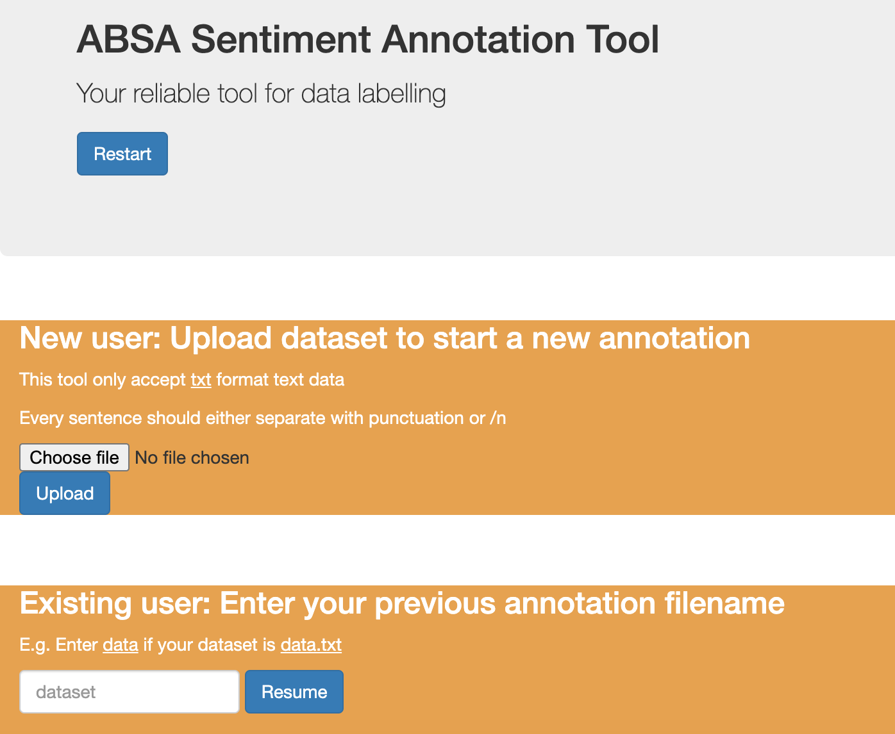

<!-- PROJECT LOGO -->
<br />
<p align="center">
  <a href="https://github.com/laukwunkei/ABSA-annotation-tool">
    
  </a>

  <h3 align="center">Aspect-based sentiment analysis annotation tool</h3>

  <p align="center">
    This project serves to help human annotators to label sentence with aspect-based sentiments.
  </p>
</p>


<!-- ABOUT THE PROJECT -->
## About The Project

### Built With

* [Flask](Web application framework)
* [Bootstrap](Front-end framework)
* [Spacy](Language model for unsupervised aspect term extraction)


<!-- GETTING STARTED -->
## Getting Started

To get a local copy up and running follow these simple steps.

### Installation

1. Clone the repo
   ```sh
   git clone https://github.com/laukwunkei/ABSA-annotation-tool.git
   ```
   
### Prerequisites

This is an example of how to list things you need to use the software and how to install them.
* Open a virtual env and run requirements.txt
  ```sh
  pip install -r requirements.txt
  ```

### Start a server
* Run app.py
    ```sh
  python3 app.py
  ```

* Start a new terminal for parallel annotation (change xxxx to new combination)
    ```sh
  export FLASK_APP=app.py
  flask run --host 0.0.0.0 --port xxxx
  ```

<!-- USAGE EXAMPLES -->
## Usage

Data flow diagram:
<br />
<a href="https://github.com/laukwunkei/ABSA-annotation-tool">
    
  </a>

### Restart
* We recommend press **restart** whenever you start a new annotation to clean cache
* This will redirect you to home page

### Input
* New annotation: Upload <ins>.txt</ins> format dataset to database
* Resume with existing annotation: Enter dataset name to resume where you stop from previous session

### Annotation process 
* Auto-dependency detection
* Manual dependency labelling 

### Output
* Output file is named after dataset e.g. review.txt -> review_output.json
Data structures:
{"sentence":[{"aspectterm1, polarityterm1": sentiment},{"aspectterm2, polarityterm2": sentiment}]}

Sample:
{"I liked the aluminum body.": [], 
"Lightweight and the screen is beautiful!": [{"screen, beautiful": "1"}, {"screen, lightweight": "1"}]}

<!-- Testing EXAMPLES -->
## Testing
* Open multiple terminal and run test files in parallel 


<!-- LICENSE -->
## License

Distributed under the MIT License. See `LICENSE` for more information.


<!-- CONTACT -->
## Contact

Louis Lau - [@email](z5265204@ad.unsw.edu.au) - email

Project Link: [https://github.com/laukwunkei/ABSA-annotation-tool](https://github.com/laukwunkei/ABSA-annotation-tool)


<!-- MARKDOWN LINKS & IMAGES -->
<!-- https://www.markdownguide.org/basic-syntax/#reference-style-links -->
[contributors-shield]: https://img.shields.io/github/contributors/github_username/repo.svg?style=for-the-badge
[contributors-url]: https://github.com/github_username/repo/graphs/contributors
[forks-shield]: https://img.shields.io/github/forks/github_username/repo.svg?style=for-the-badge
[forks-url]: https://github.com/github_username/repo/network/members
[stars-shield]: https://img.shields.io/github/stars/github_username/repo.svg?style=for-the-badge
[stars-url]: https://github.com/github_username/repo/stargazers
[issues-shield]: https://img.shields.io/github/issues/github_username/repo.svg?style=for-the-badge
[issues-url]: https://github.com/github_username/repo/issues
[license-shield]: https://img.shields.io/github/license/github_username/repo.svg?style=for-the-badge
[license-url]: https://github.com/github_username/repo/blob/master/LICENSE.txt
[linkedin-shield]: https://img.shields.io/badge/-LinkedIn-black.svg?style=for-the-badge&logo=linkedin&colorB=555
[linkedin-url]: https://linkedin.com/in/github_username
